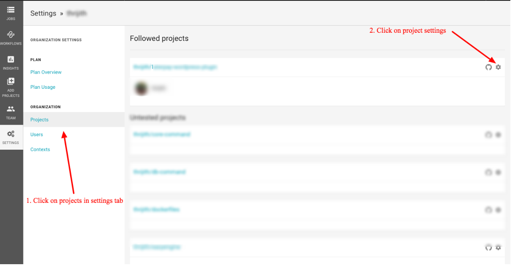
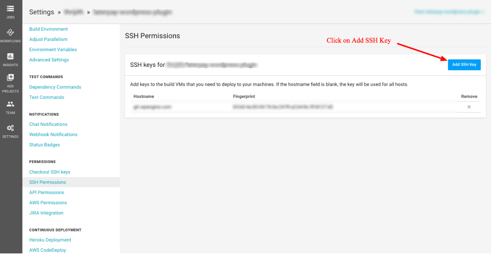
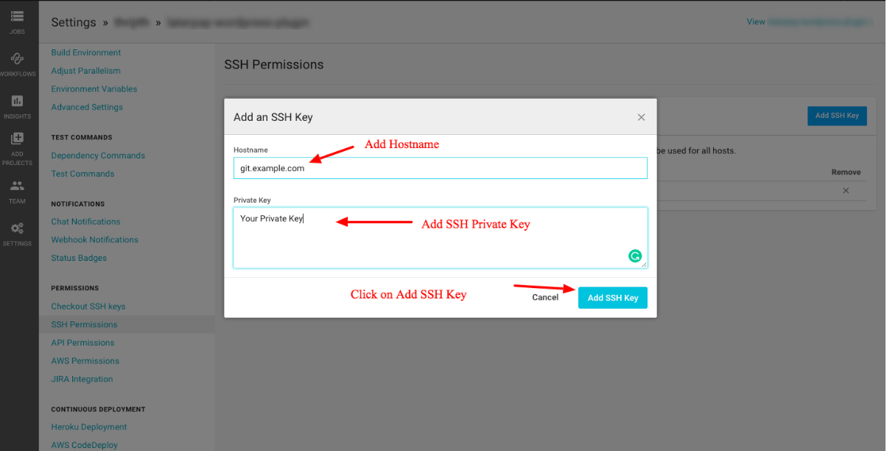
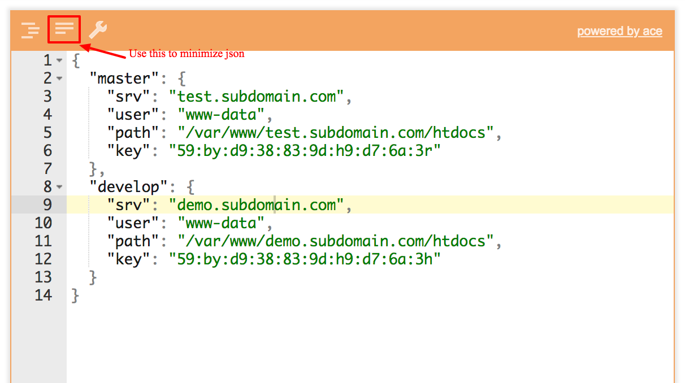

# ci-demo

This demo repo will include basic circle ci for below.

- phpcs
- deploy

It also supports composer, npm, gulp as it's part of [docker image](https://hub.docker.com/r/vaishu27/ci-deployer-wp/tags) we have used here.

**PHPCS**

phpcs will run on diff of latest commit and master branch. For phpcs below files are required.

- phpcs.xml
- setup_phpcs.sh
- parse-diff-ranges.php
- filter-report-for-patch-ranges.php

**DEPLOY**

This demo deploys to server using deployer and circle-ci. Follow below steps to setup SSH for deployer.

- Visit https://circleci.com/ and login with GitHub.
- Go to user settings and link your github account.( Skip this step if you already logged in with github account )
- Click on Add Projects, then click on Set up Project for whichever github directory you want to do setup
- Click on `Start building` button
- GO TO Settings->Projects
- Click on project `setting` icon listed under `Followed Projects` title
    
    

- Create a SSH Key without passphrase ( `ssh-keygen -t rsa -b 4096 -C circleci-key` )
- In _SSH Permissions_ menu, click on `Add SSH Key` and add private key created in above step
    
    

    

- Add public key to `knownhosts` on server to run deployer

**ENVIRONMENT Variables**

Circle-ci allows to add important and private variables into environment variable and access them while running scripts on server.

In project settings->`Environment Variables`, we have option to Add new variable.


We can access them in two ways

- PHP - `$server_name = getenv( 'SERVER_NAME' );`
- shell - `$PROJECT_ROOT`

Below is the list of variable used in this project.

- SSH_FINGERPRINT - SSH fingerprint (private key) to deploy ( saved in circleci SSH keys ). This will be default if server specified key is not set.
- IS_VIP - `yes` - This var will be used while deploying mu-plugins. If yes then it will deploy mu-plugins to wp-content.
- SERVER_DETAILS - This variable contains multiple server details for deployer in `JSON` format.
    - array key( master,develop ) - branch name or server to deploy
    - srv - Server name to deploy
    - user - User to ssh login
    - path - directory path to deploy on server
    - key - SSH key fingerprint for particular server to deploy
    - Example - Below is correct form of JSON data to store.
   ```
   {
     "master": {
       "srv": "test.subdomain.com",
       "user": "www-data",
       "path": "/var/www/test.subdomain.com/htdocs",
       "key": "59:by:d9:38:83:9d:h9:d7:6a:3r"
     },
     "develop": {
       "srv": "demo.subdomain.com",
       "user": "www-data",
       "path": "/var/www/demo.subdomain.com/htdocs",
       "key": "59:by:d9:38:83:9d:h9:d7:6a:3h"
     }
   }
   ```

Note: You can use [jsoneditoronline](https://jsoneditoronline.org) for generating JSON in above format and store minimized version to env variable.


